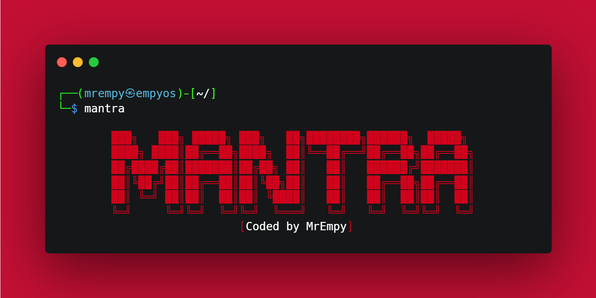
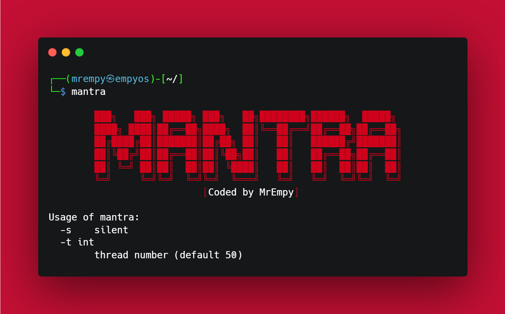

<h1 align="center">「🔑」 About Mantra</h1>

<p align="center"></p>

The tool in question was created in Go and its main objective is to search for API keys in JavaScript files and HTML pages.

It works by checking the source code of web pages and script files for strings that are identical or similar to API keys. These keys are often used for authentication to online services such as third-party APIs and are confidential and should not be shared publicly.

By using this tool, developers can quickly identify if their API keys are leaking and take steps to fix the problem before they are compromised. Furthermore, the tool can be useful for security officers, who can use it to verify that applications and websites that use external APIs are adequately protecting their keys.

In summary, this tool is an efficient and accurate solution to help secure your API keys and prevent sensitive information leaks.

## Help


## Usage


## Install

From go:

```
go install github.com/MrEmpy/mantra@latest
```

From source code:

```
git clone https://github.com/MrEmpy/mantra
cd mantra
make
./build/mantra-amd64-linux -h
```

## Buy me a coffee?

<a href="https://pixgg.com/MrEmpy" target="_blank">
  
</a>
</br>
</br>
<a href="https://www.buymeacoffee.com/mrempy" target="_blank">
  
</a>
